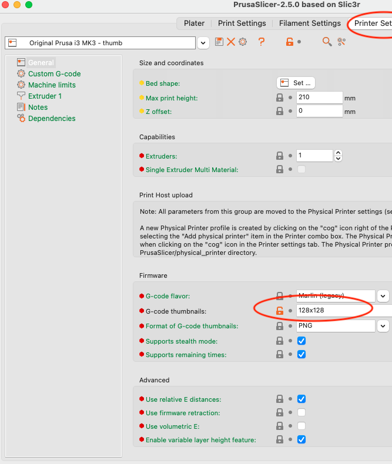
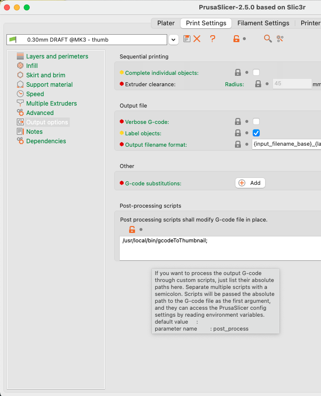

# gcodeToThumbnail
A command line tool to give PrusaSlicer GCode files icons in macOS Finder.

I got tired of my gcode files looking like 

 when they could look like this: 

To Install:

* install the compiled `gcodeToThumbnail` in `/usr/local/bin/` If you don't want to compile it yourself, grab the compiled code from [Releases](https://github.com/DavidPhillipOster/gcodeToThumbnail/releases/tag/1.0)
* In Prusa Slicer, in Printer Settings, set the thumbnail size to 128x128:

   

This will cause PrusaSlicer to append a base64-encoded 128x128 .png image of the gcode to near the end of the gcode file.

`gcodeToThumbnail` takes .gcode files as arguments on the command line, opens them read-only, reads the .png out of them, and tells Finder to add
the image as the file's icon.

PrusaSlicer is supposed to run  automatically for you if you tell it to in Print Settings:
   

but that doesn't work for me. (I filed PrusaSlicer bug [#9579](https://github.com/prusa3d/PrusaSlicer/issues/9579) to ask them to make it work. )

I have to run `gcodeToThumbnail` from the command line, passing the .gcode file (You can drag from Finder to Terminal and it will fill in the absolute path for you.) 

But when I do, it works, so now my .gcode files have decent icons in Finder.

## News

Since Feb 3 2023 I learned that PrusaSlicer gcode files can contain non-square thumbnails and multiple thumbnails.

I learned that while my tool shows those thumbnails as Finder icons when the file resides on a Mac disk, the icon vanishes when the file is moved to a FAT format SD card.

I learned that PrusaSlicer .3MF files _always_ contain a thumbnail image.

Available now, the successor to this:

[ThumbHost3mf](https://github.com/DavidPhillipOster/ThumbHost3mf) - a macOS app that has an thumbnail provider extension that tells the Finder to use the thumbnails embedded in .3mf files and some .gcode files. The icons show even on FAT format SD cards.

## License

Apache 2 [License](LICENSE)

